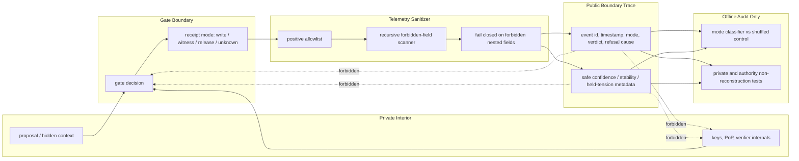

# HRT-002 Boundary Trace Flow

Status: visual implementation guide / engineering handoff.

This graph summarizes the survived HRT invariant:

> Safe public telemetry may describe boundary mode, but it may not expose private state or influence authorization.

## Current Lab Result

| Probe | Status | Metric |
|---|---|---|
| BTA-001 | pass | action macro-F1 `0.7624` vs shuffled `0.3333`; private `0.0230`; authority `0.0730` |
| WPF-001 | pass | witness action F1 `0.9983`; private `0.0272` |
| STP-001 | not promoted | sequence gain `0.00028` |
| SCM-001 / HCM-001 | not promoted | no public-policy gain over memoryless baseline |
| AIR-001 | green for HRT + witness only | build HRT-002 telemetry-only |

## Build Law

Build a boundary stethoscope, not a gate.

HRT-002 may help later analysis understand the boundary. It must never authorize, deny, retry, accelerate, or alter a gate decision.
