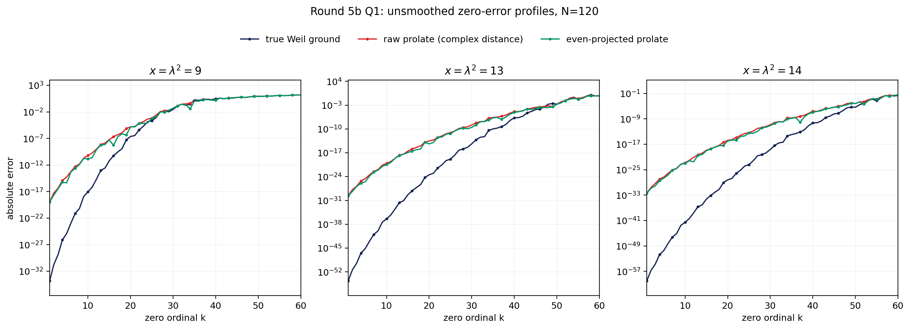

# Codex Round 5b — discriminator and commutator

## Table 1 — per-zero discriminator, $N=120$

| $x$ | $k$ | true Weil error | raw prolate error | raw / Weil | even prolate error | even / Weil |
|---:|---:|---:|---:|---:|---:|---:|
| 9 | 1 | 1.5823e-34 | 1.1480e-19 | 7.2550e+14 | 1.1387e-19 | 7.1962e+14 |
| 9 | 2 | 2.0606e-31 | 5.6198e-18 | 2.7273e+13 | 2.2947e-18 | 1.1137e+13 |
| 9 | 3 | 1.4609e-29 | 4.7888e-17 | 3.2780e+12 | 3.4790e-17 | 2.3814e+12 |
| 9 | 4 | 8.2937e-27 | 1.3056e-15 | 1.5742e+11 | 5.8418e-16 | 7.0437e+10 |
| 9 | 5 | 1.2795e-25 | 5.6208e-15 | 4.3931e+10 | 4.4142e-16 | 3.4501e+09 |
| 9 | 6 | 1.1744e-23 | 6.0320e-14 | 5.1363e+09 | 4.9812e-14 | 4.2415e+09 |
| 9 | 7 | 7.5285e-22 | 5.2576e-13 | 6.9835e+08 | 2.5381e-13 | 3.3714e+08 |
| 9 | 8 | 6.5659e-21 | 1.5894e-12 | 2.4207e+08 | 1.2752e-12 | 1.9422e+08 |
| 9 | 9 | 1.1879e-18 | 2.0233e-11 | 1.7032e+07 | 1.7405e-11 | 1.4652e+07 |
| 9 | 10 | 8.7872e-18 | 6.4876e-11 | 7.3830e+06 | 1.4150e-11 | 1.6103e+06 |
| 9 | 11 | 7.2845e-17 | 1.8655e-10 | 2.5609e+06 | 2.4854e-11 | 3.4119e+05 |
| 9 | 12 | 2.2126e-15 | 9.9413e-10 | 4.4930e+05 | 7.7207e-10 | 3.4894e+05 |
| 9 | 13 | 9.7491e-14 | 6.8922e-09 | 7.0695e+04 | 5.6236e-09 | 5.7683e+04 |
| 9 | 14 | 2.6961e-13 | 1.3992e-08 | 5.1898e+04 | 7.3228e-09 | 2.7161e+04 |
| 9 | 15 | 6.3408e-12 | 6.0901e-08 | 9.6046e+03 | 5.2493e-08 | 8.2786e+03 |
| 9 | 16 | 5.6332e-11 | 2.1228e-07 | 3.7683e+03 | 5.3490e-09 | 9.4955e+01 |
| 9 | 17 | 2.9304e-10 | 5.3060e-07 | 1.8107e+03 | 2.0542e-07 | 7.0099e+02 |
| 9 | 18 | 1.2164e-09 | 1.1318e-06 | 9.3046e+02 | 7.2854e-07 | 5.9895e+02 |
| 9 | 19 | 5.5763e-08 | 7.6168e-06 | 1.3659e+02 | 4.4687e-07 | 8.0137e+00 |
| 9 | 20 | 2.4158e-07 | 1.5829e-05 | 6.5522e+01 | 1.5309e-05 | 6.3371e+01 |
| 13 | 1 | 2.4363e-55 | 2.9293e-30 | 1.2024e+25 | 2.3411e-30 | 9.6094e+24 |
| 13 | 2 | 4.4957e-52 | 1.5170e-28 | 3.3743e+23 | 4.7227e-29 | 1.0505e+23 |
| 13 | 3 | 4.1559e-50 | 1.7254e-27 | 4.1518e+22 | 1.3242e-27 | 3.1863e+22 |
| 13 | 4 | 3.6520e-47 | 5.4207e-26 | 1.4843e+21 | 1.1317e-26 | 3.0989e+20 |
| 13 | 5 | 7.1137e-46 | 2.4878e-25 | 3.4971e+20 | 3.0773e-26 | 4.3258e+19 |
| 13 | 6 | 1.0605e-43 | 3.3825e-24 | 3.1897e+19 | 1.4368e-24 | 1.3549e+19 |
| 13 | 7 | 1.0048e-41 | 3.2973e-23 | 3.2816e+18 | 2.3198e-23 | 2.3087e+18 |
| 13 | 8 | 1.1894e-40 | 1.1686e-22 | 9.8248e+17 | 7.7818e-23 | 6.5425e+17 |
| 13 | 9 | 4.1248e-38 | 2.3014e-21 | 5.5795e+16 | 9.4935e-22 | 2.3016e+16 |
| 13 | 10 | 3.9820e-37 | 7.8905e-21 | 1.9815e+16 | 3.6723e-21 | 9.2223e+15 |
| 13 | 11 | 5.4997e-36 | 2.8207e-20 | 5.1287e+15 | 1.4286e-20 | 2.5975e+15 |
| 13 | 12 | 3.0418e-34 | 2.4352e-19 | 8.0060e+14 | 2.3121e-19 | 7.6013e+14 |
| 13 | 13 | 2.2928e-32 | 2.1915e-18 | 9.5583e+13 | 1.4536e-18 | 6.3400e+13 |
| 13 | 14 | 8.4589e-32 | 3.9960e-18 | 4.7241e+13 | 3.8188e-18 | 4.5146e+13 |
| 13 | 15 | 4.8171e-30 | 3.0431e-17 | 6.3172e+12 | 1.2070e-17 | 2.5057e+12 |
| 13 | 16 | 6.6059e-29 | 1.2304e-16 | 1.8626e+12 | 2.9554e-17 | 4.4738e+11 |
| 13 | 17 | 6.0780e-28 | 3.8294e-16 | 6.3005e+11 | 8.1565e-17 | 1.3420e+11 |
| 13 | 18 | 4.6623e-27 | 1.0786e-15 | 2.3136e+11 | 1.2584e-16 | 2.6991e+10 |
| 13 | 19 | 5.5016e-25 | 1.2327e-14 | 2.2407e+10 | 1.2325e-14 | 2.2402e+10 |
| 13 | 20 | 3.5374e-24 | 3.0526e-14 | 8.6294e+09 | 4.0873e-15 | 1.1554e+09 |
| 14 | 1 | 1.0652e-60 | 4.0480e-33 | 3.8004e+27 | 3.5824e-33 | 3.3632e+27 |
| 14 | 2 | 2.0774e-57 | 2.8245e-31 | 1.3596e+26 | 1.4603e-31 | 7.0293e+25 |
| 14 | 3 | 2.0028e-55 | 4.6204e-30 | 2.3070e+25 | 8.5703e-31 | 4.2791e+24 |
| 14 | 4 | 1.8856e-52 | 1.1747e-28 | 6.2298e+23 | 3.6179e-29 | 1.9187e+23 |
| 14 | 5 | 3.8104e-51 | 4.8995e-28 | 1.2858e+23 | 2.2296e-28 | 5.8515e+22 |
| 14 | 6 | 6.1291e-49 | 7.4708e-27 | 1.2189e+22 | 2.1095e-27 | 3.4418e+21 |
| 14 | 7 | 6.1728e-47 | 7.6743e-26 | 1.2432e+21 | 6.2406e-26 | 1.0110e+21 |
| 14 | 8 | 7.6629e-46 | 2.8813e-25 | 3.7601e+20 | 2.3109e-25 | 3.0157e+20 |
| 14 | 9 | 2.9392e-43 | 5.6043e-24 | 1.9068e+19 | 4.9373e-24 | 1.6798e+19 |
| 14 | 10 | 2.9563e-42 | 1.5106e-23 | 5.1097e+18 | 9.5303e-24 | 3.2238e+18 |
| 14 | 11 | 4.4158e-41 | 8.8161e-23 | 1.9965e+18 | 6.6806e-23 | 1.5129e+18 |
| 14 | 12 | 2.6760e-39 | 7.5166e-22 | 2.8088e+17 | 3.0592e-23 | 1.1432e+16 |
| 14 | 13 | 2.1881e-37 | 4.5140e-21 | 2.0630e+16 | 3.0421e-21 | 1.3903e+16 |
| 14 | 14 | 8.4311e-37 | 1.6617e-20 | 1.9709e+16 | 5.9298e-21 | 7.0332e+15 |
| 14 | 15 | 5.4808e-35 | 1.3329e-19 | 2.4320e+15 | 8.8677e-20 | 1.6180e+15 |
| 14 | 16 | 8.0161e-34 | 3.9162e-19 | 4.8855e+14 | 3.5939e-19 | 4.4833e+14 |
| 14 | 17 | 8.0222e-33 | 1.3806e-18 | 1.7209e+14 | 1.2091e-18 | 1.5072e+14 |
| 14 | 18 | 6.7314e-32 | 4.5963e-18 | 6.8281e+13 | 3.6927e-18 | 5.4857e+13 |
| 14 | 19 | 9.1056e-30 | 4.6999e-17 | 5.1616e+12 | 4.2933e-18 | 4.7150e+11 |
| 14 | 20 | 6.1947e-29 | 1.7222e-16 | 2.7801e+12 | 1.1167e-16 | 1.8026e+12 |

## Figure 1 — unsmoothed error profiles, $k=1,\ldots,60$

## Table 2 — affine-Galerkin commutator, $N=120$, 100 digits

| $x$ | Weil matrix | ground | $c_F$ | $r_\xi$ | $\Delta$ | $r_\xi/\Delta$ |
|---:|:---|:---:|---:|---:|---:|---:|
| 9 | authentic | even | 1.382689e-02 | 1.997851e+01 | 1.127268e-34 | 1.772295e+35 |
| 9 | pseudo-prime | odd | 1.710991e-02 | 5.030133e+03 | 2.511401e-01 | 2.002919e+04 |
| 9 | archimedean-only | odd | 1.884945e-04 | 1.341040e+03 | 8.526972e-01 | 1.572704e+03 |
| 13 | authentic | even | 1.511664e-02 | 3.050253e+01 | 3.055565e-55 | 9.982617e+55 |
| 13 | pseudo-prime | even | 1.539348e-02 | 8.406599e+03 | 3.692978e-01 | 2.276374e+04 |
| 13 | archimedean-only | odd | 3.859837e-04 | 3.063020e+03 | 1.136434e+00 | 2.695291e+03 |
| 14 | authentic | even | 1.621748e-02 | 3.381942e+01 | 1.667856e-60 | 2.027718e+61 |
| 14 | pseudo-prime | even | 1.159324e-02 | 9.918561e+03 | 3.773235e-01 | 2.628662e+04 |
| 14 | archimedean-only | odd | 4.627688e-04 | 3.675846e+03 | 1.205916e+00 | 3.048177e+03 |
| 16 | authentic | even | 1.553129e-02 | 4.103755e+01 | 5.605923e-71 | 7.320391e+71 |
| 16 | pseudo-prime | even | 1.530800e-02 | 1.338549e+04 | 3.723740e-01 | 3.594637e+04 |
| 16 | archimedean-only | odd | 6.493769e-04 | 5.144556e+03 | 1.342886e+00 | 3.830971e+03 |

**Result.** The six preregistered first-zero threshold predictions in commit `5a1889f` were correct: neither prime-free variant crosses $10^{-30}$ at $x=9$ or $13$, while both cross at $x=14$.  Under the frozen discriminator, $x=9$ is **UNVERIFIED** because the raw and even candidates are only 14.861 and 14.857 orders worse than the true Weil ground at $k=1$; $x=13$ and $14$ are **MEASURED** arithmetic discrimination because both variants are more than 20 orders worse (24.983–25.080 and 27.527–27.580 orders).  Thus the integer-dilation identity explains the broad zero landing, but not the extra first-zero precision supplied by the finite Weil matrix at $x=13,14$; the raw complex-root ordering remains **UNVERIFIED**, while the independently ordered even profile gives the same verdict.  For Q2, every authentic $r_\xi/\Delta$ is above one—by about 35, 56, 61, and 72 orders—and both controls are also above their own gaps, so the frozen affine-Galerkin commuting-operator route is **MEASURED** dead as-is and produces no mechanism trigger.  The analytic weak-form entries agree with independent 100-digit quadrature within $5.9\times10^{-98}$, full/parity assemblies within $1.5\times10^{-101}$, and two independent implementations agree in every displayed digit (at least 31 relative digits in the least-agreeing case).  This last conclusion is deliberately narrow: [CCM's classical $PW_\lambda$](https://arxiv.org/abs/2511.22755) and $QW_\lambda^N$ do not natively act on the same space, $E$ has no canonical inverse, and $h_\lambda$ is itself a mixture of two prolate modes, so this test does not rule out every possible prolate bridge.
